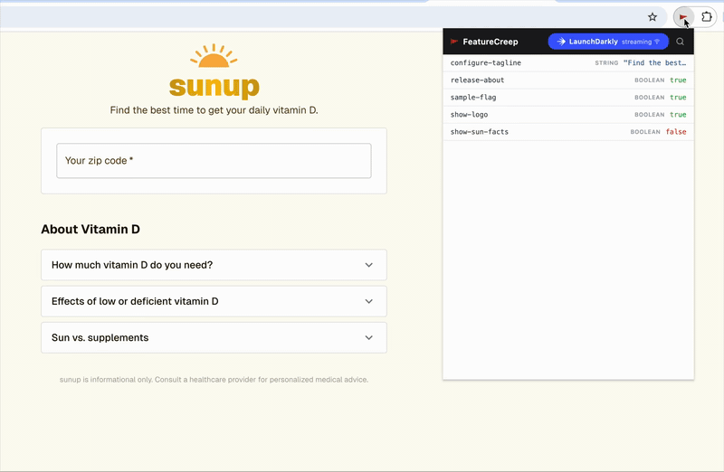

# FeatureCreep

Inspect and override feature flags without touching your app or environment config.

## Why it exists

At my last company we had 100+ flags across 5 environments and 40 engineers. Changing a flag to test something meant risking someone else's environment or breaking CI. FeatureCreep fixes that!

- See which flags are active on any page, any env, instantly
- Reproduce bugs that only appear in a specific flag state
- Test both sides of a flag without touching the dashboard
- No more waiting on someone with dashboard access to make a change

## Supported Providers

| Provider | Notes |
|---|---|
| LaunchDarkly (native JS SDK) | Full support |
| LaunchDarkly via OpenFeature adapter | Full support — same SSE stream |

## Future Providers

- OpenFeature (non-LaunchDarkly providers)
- Optimizely, PostHog, Unleash, Statsig, Split / Harness, DevCycle, GrowthBook

Don't see your provider? Open an issue or submit a pull request.

## Install

Not yet on the Chrome Web Store. Load it manually:

1. Clone this repo
2. Open `chrome://extensions`
3. Enable **Developer mode**
4. Click **Load unpacked** → select the `extension/` folder

## Limitations

- Requires LaunchDarkly streaming mode (polling not supported)
- Chrome only
